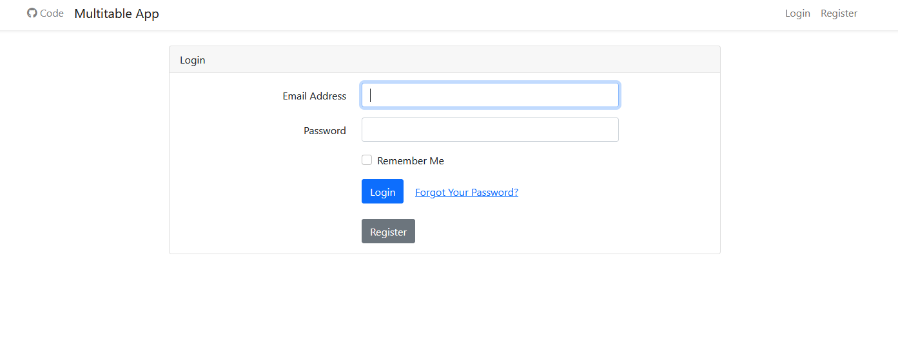
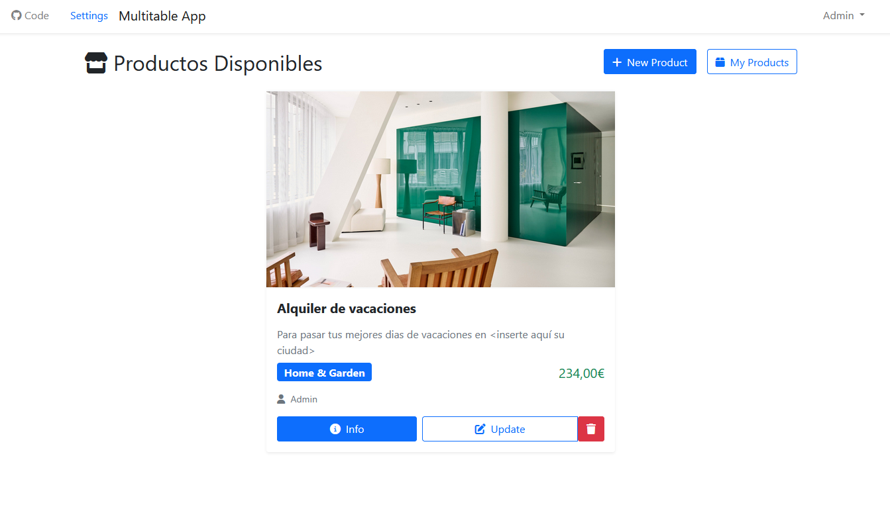
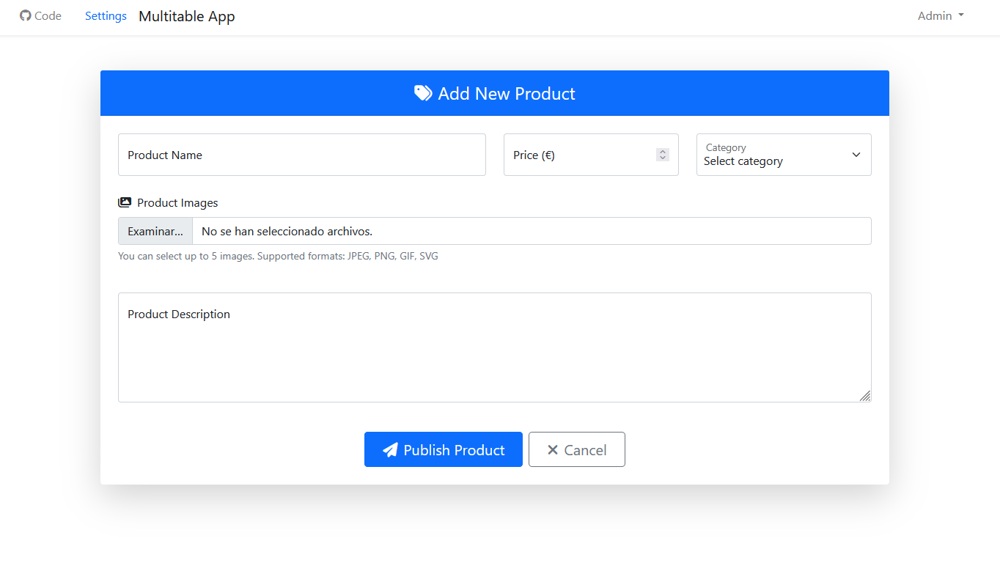
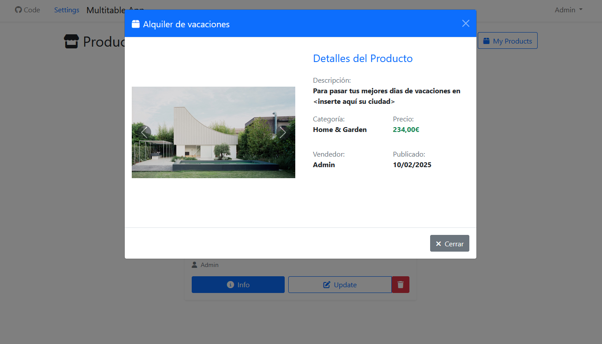
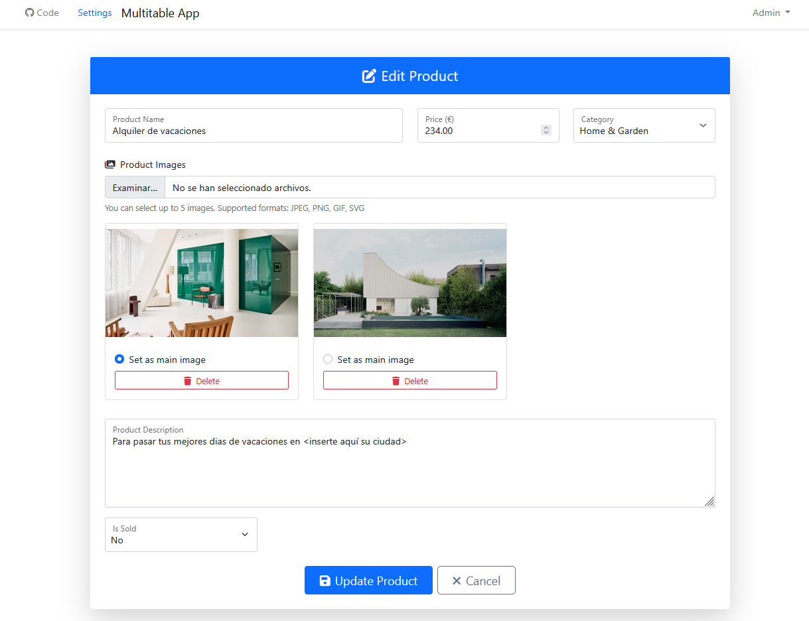
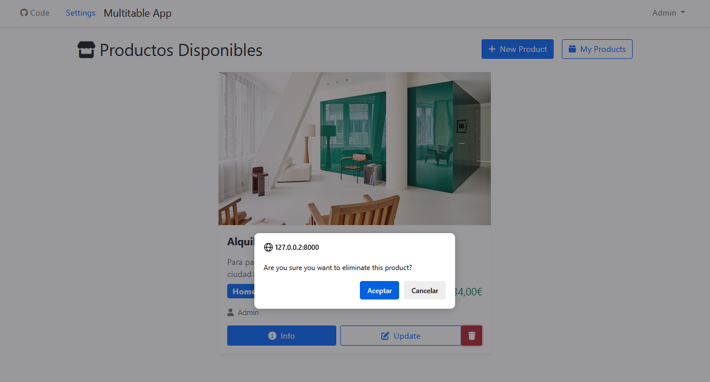
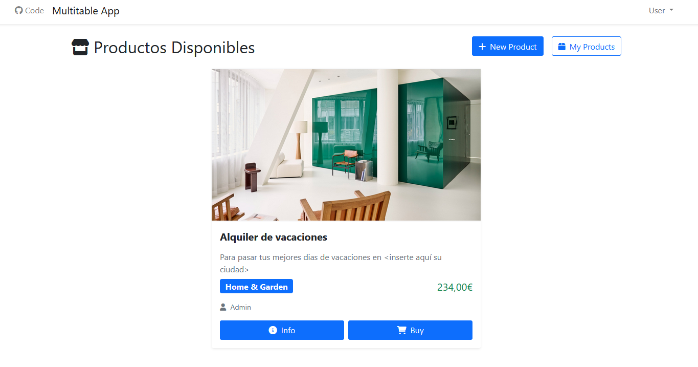
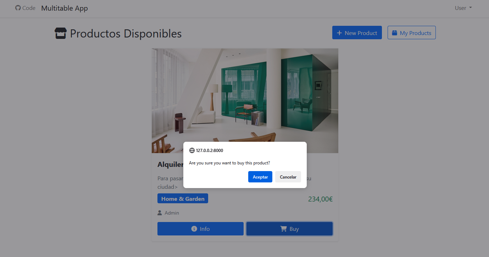
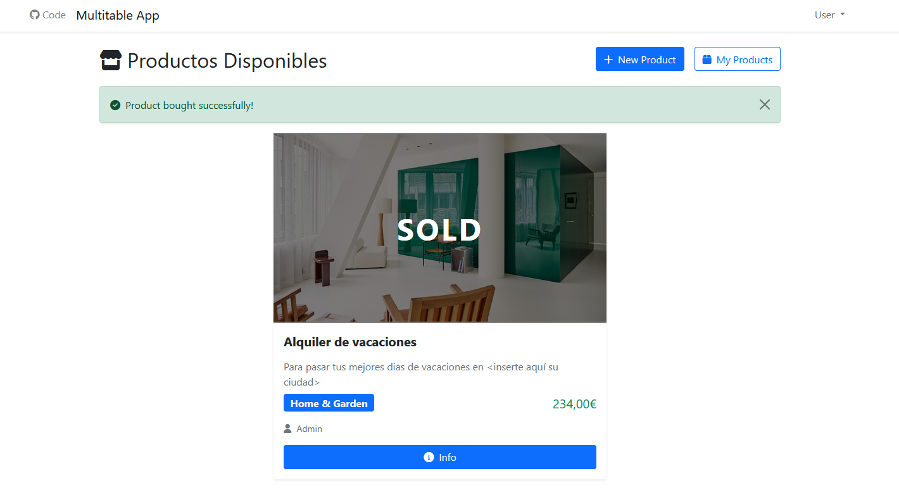

# Multitable App

Una aplicación Laravel para gestionar múltiples tablas relacionales.

## Instalación

1. **Clonar el repositorio**
    ```bash
    git clone https://github.com/rtro-dev/Multitable_App.git
    ```

2. **Configurar permisos**
    ```bash
    sudo chown -R user:www-data Multitable_App/
    sudo chmod -R 775 Multitable_App/
    ```

3. **Instalar dependencias**
    ```bash
    cd multitableApp
    composer install
    ```

4. **Configurar entorno**
    - Crear base de datos en phpMyAdmin
    - Copiar `.env.example` a `.env`
    - Configurar credenciales de base de datos

5. **Configurar autenticación**
    ```bash
    composer require laravel/ui
    php artisan ui:auth
    ```

6. **Ejecutar migraciones**
    ```bash
    php artisan migrate
    ```

7. **Crear enlace simbólico**
    ```bash
    php artisan storage:link
    ```

## Estructura del Proyecto

El proyecto utiliza los siguientes modelos:
- User
- Category
- Sale
- Setting
- Image

## Desarrollo

1. Configuración de modelos
2. Implementación de controladores
3. Definición de rutas
4. Creación de vistas

## Base de Datos

Para poblar la base de datos:
```bash
php artisan make:seeder NombreSeeder
php artisan db:seed
```

## Controladores

### AuthController
- **LoginController**: Maneja la autenticación de usuarios y redirecciones post-login
- **RegisterController**: Gestiona el registro de nuevos usuarios con validación
- **ForgotPasswordController**: Controla el proceso de recuperación de contraseñas
- **ResetPasswordController**: Maneja el reseteo de contraseñas
- **VerificationController**: Gestiona la verificación de email de usuarios
- **ConfirmPasswordController**: Maneja confirmaciones de contraseña

### SaleController 
- Gestiona las operaciones CRUD de productos/ventas
- Permite crear, editar, eliminar y mostrar productos
- Maneja la subida y gestión de imágenes
- Controla el proceso de compra de productos
- Implementa filtros y búsquedas de productos

### ImageController
- Gestiona operaciones con imágenes de productos
- Permite subir, eliminar y establecer imagen principal
- Valida tipos y tamaños de archivos
- Maneja el almacenamiento en disco

### CategoryController
- Administra las categorías de productos
- Operaciones CRUD básicas para categorías
- Validación de datos

### ProfileController
- Gestiona perfiles de usuario
- Permite cambiar contraseña, email y nombre de usuario
- Validación de datos de perfil

### SettingController
- Administra configuración global de la aplicación
- Controla número máximo de imágenes
- Accesible solo para administradores

## Rutas

- **/**: Ruta principal, muestra listado de productos
- **/login**: Autenticación de usuarios
- **/register**: Registro de nuevos usuarios
- **/sales**: CRUD de productos
- **/profile**: Gestión de perfil
- **/categories**: Administración de categorías
- **/settings**: Configuración del sistema

## Vistas

### Layouts
- **app.blade.php**: Layout principal
- **navigation.blade.php**: Barra de navegación

### Auth
- Vistas de login, registro y reset password

### Sales
- **index.blade.php**: Listado de productos
- **create.blade.php**: Formulario de creación
- **edit.blade.php**: Formulario de edición
- **show.blade.php**: Detalle de producto
- **show-modal.blade.php**: Modal de detalle

### Categories
- Vistas para gestión de categorías

### Profile
- Vista de perfil y edición

### Settings  
- Panel de configuración

## Middlewares

- **auth**: Protege rutas que requieren autenticación
- **admin**: Restringe acceso a funciones administrativas
- **guest**: Para usuarios no autenticados

## Assets

### JavaScript
- **script.js**: Manejo de imágenes y validaciones
- **deleteImg.js**: Eliminación de imágenes via AJAX

## Características principales

- Autenticación completa de usuarios
- Gestión de productos con imágenes múltiples
- Sistema de compra/venta
- Panel de administración
- Perfiles de usuario
- Categorización de productos
- Validaciones frontend/backend
- Interfaz responsive

## Imágenes









